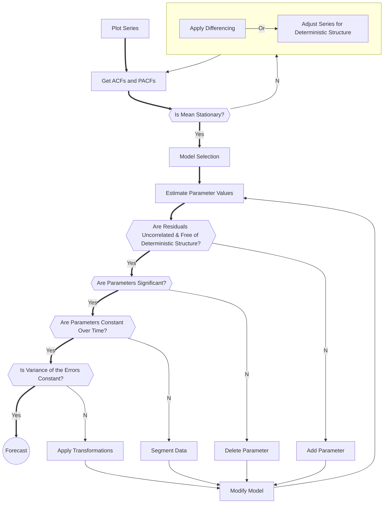

# Auto Regressive models

!!! note "Work in Progress"

    Lorem ipsum dolor sit amet, consectetur adipiscing elit. Nulla et euismod
    nulla. Curabitur feugiat, tortor non consequat finibus, justo purus auctor
    massa, nec semper lorem quam in massa.


## Data Preparation

### rolling statistics
Ploting the rolling mean and rolling standard deviation will allow to see if the time series is stationary when they remain constant with time (with the naked eye look to see if the lines are straight and parallel to the x-axis).

### augmented dickey-fuller test
The time series is considered stationary if the p-value is low (according to the null hypothesis) and the critical values at 1%, 5%, 10% confidence intervals are as close as possible to the ADF Statistics

### auto correlation function (ACF)
The correlation between the observations at the current point in time and the observations at all previous points in time. We can use ACF to determine the optimal number of MA terms. The number of terms determines the order of the model.

### partial auto correlation function (PACF)
As the name implies, PACF is a subset of ACF. PACF expresses the correlation between observations made at two points in time while accounting for any influence from other data points. We can use PACF to determine the optimal number of terms to use in the AR model. The number of terms determines the order of the model.


## Arima Flowchart




## Models

#### autoregressive model (AR)
Autoregressive models operate under the premise that past values have an effect on current values. 

#### moving average model (MA)
Assumes the value of the dependent variable on the current day depends on the previous days error terms.

#### auto regressive moving average (ARMA)
The ARMA model is simply the combination of the AR and MA models.

#### autoregressive integrated moving average model (ARIMA)
The ARIMA (aka Box-Jenkins) model adds differencing to an ARMA model. Differencing subtracts the current value from the previous and can be used to transform a time series into one that’s stationary.

#### vector auto regression (VAR)
Each variable is a linear function of the past values of itself and the past values of all the other variables
VAR is bi-directional, meaning the variables influence each other whereas ARIMA models are uni-directional, thus the predictors influence the Y and not vice-versa. 


### Regime Shift Models
modelling by segregating the time series into different “states”. These models are also called state-space models or dynamic linear models in time series modeling nomenclature.
Time series exists in two or more states, each characterized by their own probability distributions, and the transition of one state to another is governed by another process or variable

#### Threshold models
An observed variable crossing a threshold triggers a regime shift

#### Predictive models
Using methods to predict the diferent regimes

#### Markov switching autoregressive models
Assume the regime to be a ‘hidden state’ whose probability and characteristics are estimated using maximum likelihood estimation


## Statistical stationarity[1](https://people.duke.edu/~rnau/411diff.htm)
A stationary time series is one whose statistical properties such as mean, 
variance, autocorrelation, etc. are all constant over time.
A stationarized series is relatively easy to predict: you simply predict that 
its statistical properties will be the same in the future as they have been in 
the past.
Such statistics are useful as descriptors of future behavior only if the series
is stationary.
One should be cautious about trying to extrapolate regression models fitted to
nonstationary data.


### trend-stationary
If the series has a stable long-run trend and tends to revert to the trend line
following a disturbance, it may be possible to stationarize it by de-trending.

#### de-trending
- fitting a trend line and subtracting
- including the time index as an independent variable in a regression or ARIMA model

### difference-stationary
If the mean, variance, and autocorrelations of the original series are not 
constant in time, even after detrending, perhaps the statistics of the changes 
in the series between periods or between seasons will be constant.
Transform a series into a series of period-to-period and/or season-to-season differences.

#### first diference
If the first difference of Y is stationary and also completely random (not 
autocorrelated), then Y is described by a random walk model: each value is a 
random step away from the previous value. 
If the first difference of Y is stationary but not completely random--i.e., if 
its value at period t is autocorrelated with its value at earlier periods then 
a more sophisticated forecasting model such as exponential smoothing or ARIMA 
may be appropriate.

### Statistical tests
Unit root tests indicates that the statistical properties of a given series are not constant with time, which is the condition for stationary time series.
Used to determine the presence of unit root in the series.
```math
y_t = a^n*y_{t-n} + Σε_{t-i}*a^i
```
If the value of a is 1 (unit) in the above equation, then the predictions will be equal to the yt-n and sum of all errors from t-n to t, which means that the variance will increase with time. This is knows as unit root in a time series. We know that for a stationary time series, the variance must not be a function of time. The unit root tests check the presence of unit root in the series by checking if value of a=1

#### Augmented Dickey Fuller (ADF) Test
Null Hypothesis: The series has a unit root (value of a =1)
Alternate Hypothesis: The series has no unit root.
If we fail to reject the null hypothesis, we can say that the series is non-stationary. This means that the series can be linear or difference stationary 

#### Kwiatkowski-Phillips-Schmidt-Shin (KPSS) Test
Null Hypothesis: The process is trend stationary.
Alternate Hypothesis: The series has a unit root (series is not stationary).
null hypothesis as the process is trend stationary, to an alternate hypothesis of a unit root series

### Types of Stationarity
#### Strict Stationary
A strict stationary series satisfies the mathematical definition of a stationary process. For a strict stationary series, the mean, variance and covariance are not the function of time. The aim is to convert a non-stationary series into a strict stationary series for making predictions.

#### Trend Stationary
A series that has no unit root but exhibits a trend is referred to as a trend stationary series. Once the trend is removed, the resulting series will be strict stationary. The KPSS test classifies a series as stationary on the absence of unit root. This means that the series can be strict stationary or trend stationary.

#### Difference Stationary
A time series that can be made strict stationary by differencing falls under difference stationary. ADF test is also known as a difference stationarity test.

#### Possible outcomes of stationary tests
- Case 1: Both tests conclude that the series is not stationary -> series is not stationary
- Case 2: Both tests conclude that the series is stationary -> series is stationary
- Case 3: KPSS = stationary and ADF = not stationary  -> trend stationary, remove the trend to make series strict stationary
- Case 4: KPSS = not stationary and ADF = stationary -> difference stationary, use differencing to make series stationary


